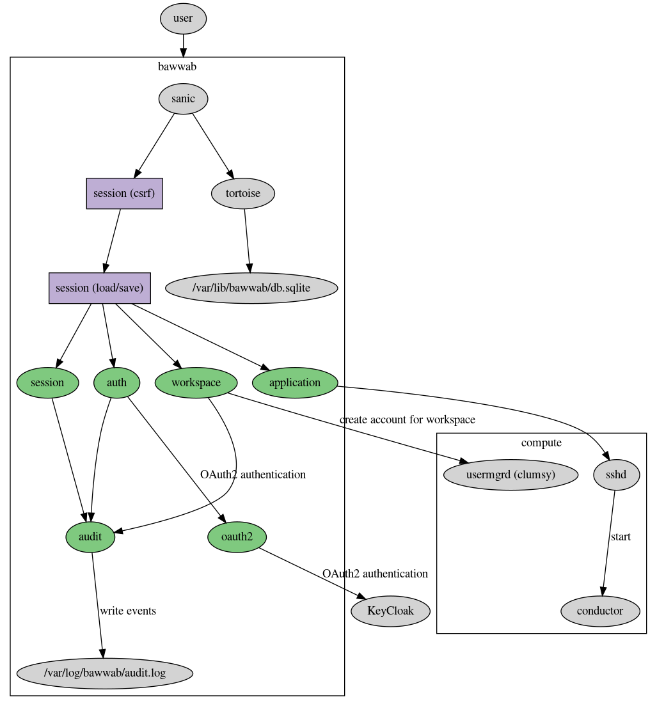

bawwab
======

A web gateway to compute clusters, but really just a glorified SSH client.

(This software is probably not very useful to you. It is heavily branded and
has lots of hard-coded assumptions.)

Depends on trash-cli, mashru3 on the target.

Prerequisites
-------------

You’ll need some form of automated user management, which clumsy_ provides, a
working installation of conductor_, an OAuth2-capable sign-on (only KeyCloak_
is supported right now) and a recent OpenSSH (>= 7.0) [#]_.

A good method to deploy bawwab is using guix_:

.. code:: bash

	guix package -p /usr/local/profiles/bawwab -f contrib/bawwab.scm

Then use the systemd service file provided in ``contrib/bawwab.service`` to run it.

.. [#] asyncssh’s .terminate() does not have an effect on prior versions, see
	`channel.py <https://github.com/ronf/asyncssh/blob/f2c73b12a6977ec71b0ae19894e6f5f4022e4450/asyncssh/channel.py#L1259>`__
.. _clumsy: https://github.com/leibniz-psychology/clumsy
.. _guix: https://guix.gnu.org
.. _conductor: https://github.com/leibniz-psychology/conductor
.. _KeyCloak: https://www.keycloak.org/

Design
------

bawwab is a JavaScript application based on VueJS_ and `VueJS router`_ with a
Python backend based on sanic_ and tortoise-orm_. It interacts with the
software mentioned above in the following ways:

.. _VueJS: https://vuejs.org/
.. _VueJS router: https://router.vuejs.org/
.. _sanic: https://sanic.readthedocs.io/en/latest/
.. _tortoise-orm: https://tortoise-orm.readthedocs.io/en/latest/

